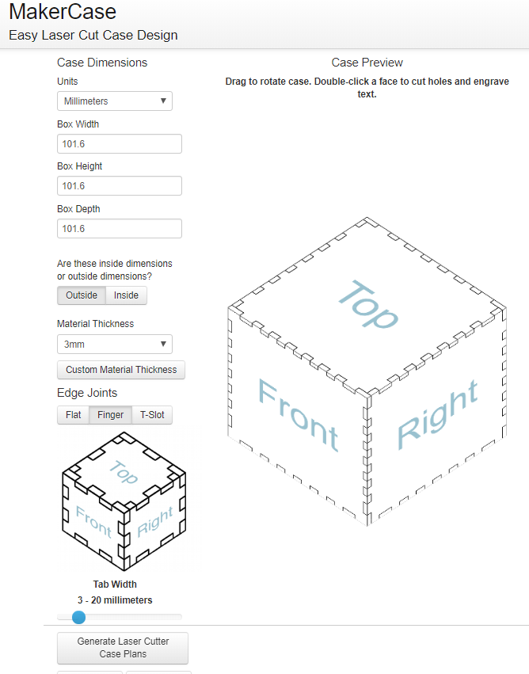
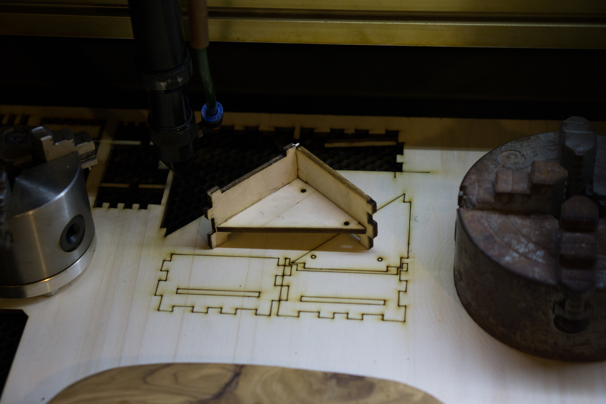
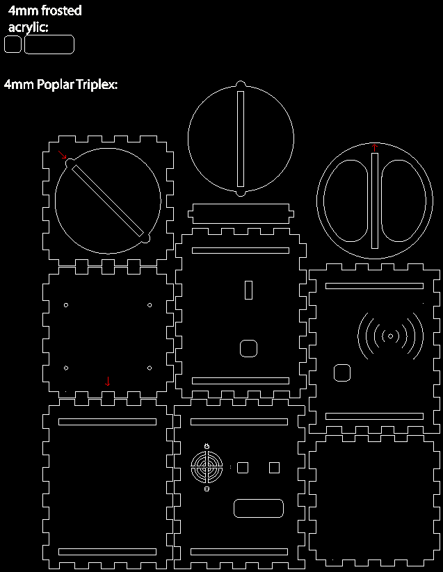

Prototyping 1 - 11/12/18 - 14/12/18

## **Making a case for the MUV proximity sensor:**

**Proximity sensor, PCB + Components Dimensions:**

Screw holes: 51.5mm x 38.75mm

H: 70mm

W: 59mm x 59mm

**Proximity Sensor Case, Key points for design:**

-Allow NFC to function

-Design for manufacture with Fablab machines

-Ease of assembly

-Access to all buttons and USB port

-Access to battery

-B,C and Tag LEDs all visible

**Research and Preparation:**

I chose 4mm poplar triplex as a material for the proximity sensor as I think it well suited to the intended application of the proximity sensor; they will be indoors and there will be many of them. The 4mm poplar triplex is a good value for its level of durability.

I did tests to find the right sizing and settings for making press fit components on our lasercutter. After some time I decided that Speed 100 and Power 100 gave a good balance between keeping corners sharp and minimizing burning. It also has the added benefit of cutting quickly.

Next I had to find out the kerf of my lasercutter with this material at these settings. Cutting the slots of my press fit joints to 3.7mm gave a good fit with the 4mm triplex I have decided to use for the proximity sensor case.

Here's a guide on how to figure out the kerf of your lasercutter:
http://fab.academany.org/2018/labs/fablabuae/laser.html

All of the designs here were made with the .15 (each side) kerf of my lasercutter, you will have to adjust the sizing of the joints for the characteristics of your lasercutter.

## **Designing & Making:**

**Designing:**

If I make the box with press-fit finger joints on all sides, then the enclosures can be stacked in the x and y axis, providing opportunity for expansions to the proximity sensor in the future.

For this project, I think its the most time effective to use an online lasercut box generator.

A quick google search gave me some online options for designing lasercut joints. I liked "makercase.com" because of its  simplicity and visual preview.

I used makercase to quickly design the joints of the box. The website allows you to enter the kerf of your lasecutter and adjusts the files it outputs to press fit together nicely.

I then edited the parts in illustrator to make the width of the joints the same along the whole length of all sides of the case.(makercase.com makes the first and last joints larger, I don't want this)  This will allow the boxes to be stacked together as per my design. 

I cut out small sections of each part to check the fit without wasting much material: 

After I had the basic box shape, I measured and mapped out the required holes for the buttons and LEDs to be usable/ visable, again testing as I went.

Here is the plans for the final design of my case for the MUV proximity sensor:

Each part of the design can be cut halfway and the joint pattern can be extended to make any height or width box.

**Materials Needed:**

4mm triplex poplar (300mm x 320mm)

Small pieces of frosted acrylic to act as diffusers for the LEDs ( can be cut from scrap)

Small piece of double sided tape

2x m2.6 x 20 screws and nuts

4x m2.6 x 7.5 screws and nuts

Sandpaper, CA glue and rubber hammer (if needed to help with assembly)

**Making/ Instructions:** 

Step 0:

Collect your parts:

Step 1:

Step 2: 

Stick battery to the back of NFC sensor:

Step 3: 

Scrwe the PCB to the the floor plate with the NFC sensor facing the arrow:

Step 4:

Insert Acrylic piece into the front plate:

Step 5:

Attach the front to base plate:

Step 6:

Attach the side plate with the USB and ON/OFF holes:

Step 7:

Insert the ON/OFF switch into the side plate:

Step 8:

Attach the side plate without any holes halfway:

Step 9: 

Insert the top plate with the hole for the lid:

Step 10:

Insert the acrylic piece into the back plate:

Step 11:

Attach the back plate halfway:

Step 12:

Insert the buttons into the back plate:

Step 13:

Make sure they fit securely enough, use some CA glue if needed:

Step 14: 

Attach the speaker with the longer screws:

Step 15: 

Then secure with the nuts:

Step 16:

Gather the 3 lid parts:

Step 17:

Join the middle and bottom pieces of the lid:

Step 18:

Attach the top of the lid:

Step 19:

Insert the whole lid into the top plate of the box and turn to close:

Step 20:

Attach the bottom cover on one side:

Step 21: 

Carefully join the other sides of the bottom cover with the rest of the box:

Step 22:

Sit back and admire your finished MUV Proximity Sensor case!

