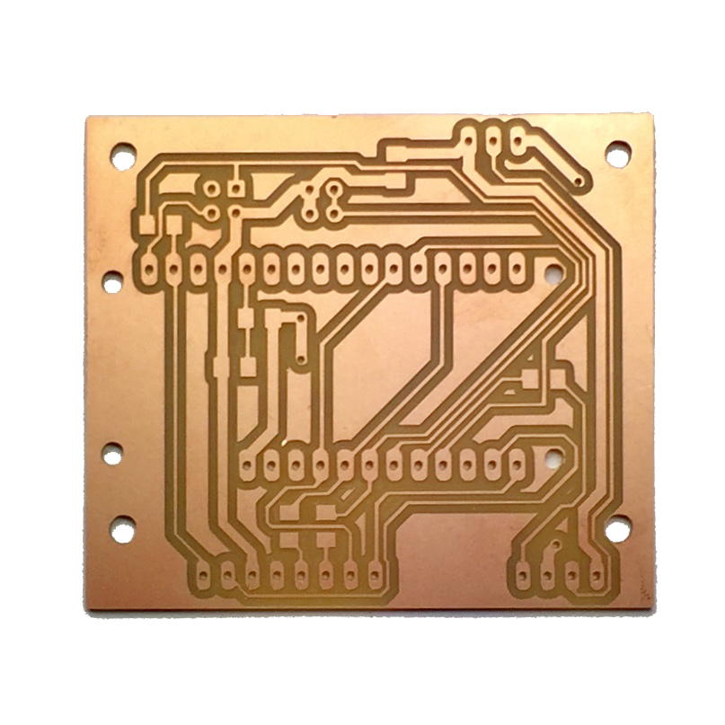

# Parts
The PK_MUV kit is a portable device made of the following parts and features:

* Mcu/WiFi: Adafruit Feather HUZZAH esp8266 board
* NFC Reader: RC522 NFC reader
* Visual feedback: 3 WS1282 LEDs
* Audio feedback: buzzer
* Power switch
* Reset button
* Configuration button
* Indicator RGB Led for battery status
* Indicator RGB Led for configuration mode
* Indicator RGB Led for feedback
* Power supply: rechargeable battery or micro USB cable
* 6 mounting holes

The PK_MUV uses two off-the-shelf boards, the [Adafruit Feather HUZZAH esp8266](https://learn.adafruit.com/adafruit-feather-huzzah-esp8266/overview) and the NFC reader breakout board based on [MFRC522 chip](https://www.nxp.com/docs/en/data-sheet/MFRC522.pdf), and four boards made in the fablab, the PK_MUV pcb, the PK_MUV_L1 pcb, the PK_MUV_L2 pcb and the PK_MUV_sw pcb.

The boards are made using the small milling machine Roland Modela MDX-20, each pcbs require two jobs: mill the trace and cut/drill the boards, in the folder digital files you find the png machinable files.
Tools used:
- one side copper plate, FR1
- to mill the traces: endmill, 0,4mm diameter
- to cut and drill: endmill, 1/64 inch diameter

The files used on the machine are in the folder [Machinable files](https://github.com/emmapa/proximity_kit/tree/master/PK_MUV/Tech/Machinable%20files). 
The original Eagle files are in the [Eagle files](https://github.com/emmapa/proximity_kit/tree/master/PK_MUV/Tech/Eagle%20files).

#### PK_MUV pcb

| top view  | bottom view |
| ------------- | ------------- |
| 

  | 

 |
| All the header are THT, pitch 2.54mm.   JP_LEDS: 1x3 female header, THT   JP_BUZ: holes for piezo  JP_SW: 2x2 male header  Feather header 1: 1x16 female header  Feather header 2: 1x16 female header  JP_LED_TAG: 1x4 female header  JP_NFC: 1x8 female header   | All the resistors are smd 1206.  R1: 1M Ohm  R2: 220k Ohm  R3: 0 Ohm  R4: 0 Ohm  R5: 10k Ohm  R6: 470 Ohm   R7: 0 Ohm |
| 

  | 

|
|

| 

**note**: the red traces are jumper wires placed on the top layer

#### PK_MUV_L1 pcb

| top view  | bottom view |
| ------------- | ------------- |
| 

  | 

 |
| The header is THT, pitch 2.54mm.   JP1: 1x04 male header 90° | Capacitors is smd 1206.  C1: 0.1uF   U1: WS2812B Led|
| 

  | 

|
| 

  | 

|

#### PK_MUV_L2 pcb

| top view  | bottom view |
| ------------- | ------------- |
| 

  | 

 |
| The header is THT, pitch 2.54mm.   JP1: 1x03 male header 90°   | Resistors and capacitors are smd 1206.  C1=C2: 0.1uF   U1=U2: WS2812B Led |
| 

  | 

|
| 

  | 

|

#### PK_MUV_sw pcb

| top View  | bottom view |
| ------------- | ------------- |
| 

  | 

 |
| sw1 = sw2: Tactile Switch THT | The header is smd, pitch 2.54mm   JP1: 2x2 male header  |
| 

  | 

|
|

| 

 |

### Battery cable
The switch power is inserted in the power wire of the battery.

       

Depending on the size of the case and the arrangements inside it, you could need to extend the power cable. This [tutorial](https://learn.adafruit.com/on-slash-off-switches) explains step-by-step how to wire the on/off switch, the material are part of the BOM.

### Assembly notes
#### Buzzer
On the PK_MUV pcb there two holes dedicated to the transducer element, depending on the model and the wires,  you can use both THT pads or just one.

       

#### Switches
The connection of the switches to the main board happens with two IDC connectors and a four wires flat cable.
It is important to plug the connectors in the right orientation, in the photos below you can see the alignment between the two boards.

       

#### General overview
The PK_MUV uses female/male header to attach the different boards but it works also using different settings.
You could solder all the components directly on the PK_MUV board to have a more compact and robust solution.
You could also use jumper wires to place the pcb far from the main pcb.

### BOM notes
Many items in the BOM can be bought only in minimum amount, when you actually are going to use one or two component. The total cost is therefore expressed as:
* total purchase: the cost of the purchase, buying the minimum amount per items
* cost of 1 kit: considering the cost of only the component used in the kit.

for example: if you buy the "feather header 1" from Farnell, you have to buy 10 components even if you are going to use only one. In the purchase cost the item "feather header 1" is 12€ but in the single cost of one kit, the item value is 1,2€.
