# PK_MUV

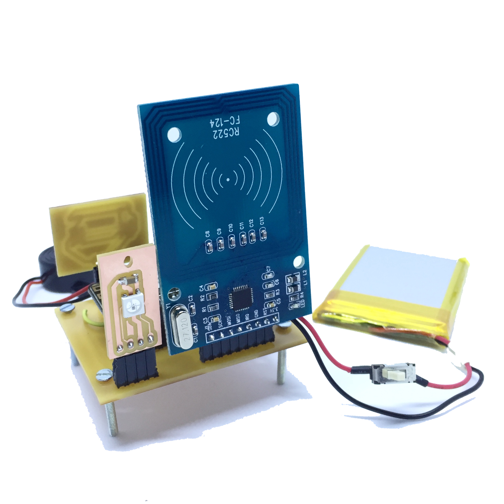

This page contains the description of the PK_MUV kit and the instructions to use it. 
In the Repo you also find:
* blocks diagram
* digital files to reproduce it, Eagle file and png files
* code
* BOM

The kit described in this Repo is about the electronics components and the firmware to realise the PK_MUV.

## Intro
The goal of the kit is to enable users of the application MUV, to identify proximity to strategic locations or routes, where the PK_MUV is located. The detection of proximity uses NFC technology and the user must be in possession of a [Tag_MUV](MUV-Tags) to properly use this feature of the app.
The PK_MUV is the device where the user can register proximity and it can be located in places important for the MUV project, for example: schools, offices, shops, parks, public services.

The PK_MUV is a WiFi module (esp8266) with NFC reader (RC522).
The PK_MUV kit is programmed to read [Tag_MUV](MUV-Tags). When the user operates the TAG_MUV on PK_MUV kit, the following informations are sent to the MUV server:
* Tag_MUV UID to identify the user
* PK_MUV ID to identify the location of the kit. 

The kit includes:
- Power slide switch: to turn on/off the kit when it runs on battery
- Reset switch: to reset the kit while it is operating
- Config switch: it is used to enter in configuration mode or run the check routine.
- Tag Led: rgb Led that gives feedback when a tag is detected by the reader, also called Tag routine.
- Config Led: rgb Led that gives feedback during the start-up and the check routines.
- Batt Led: rgb Led that visualise the battery status.

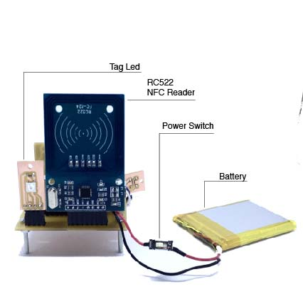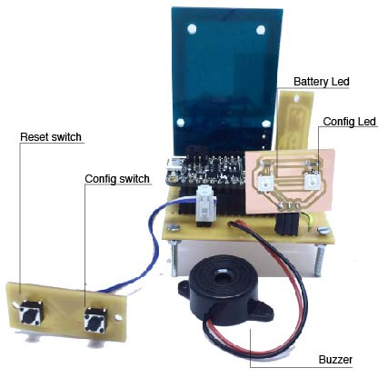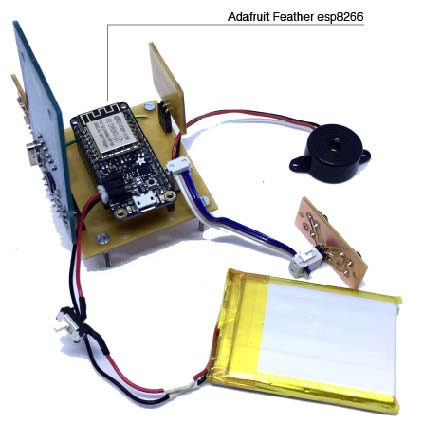

### Connect the PK_MUV to the local WiFi
Turn on the PK_MUV (ON/OFF switch). If the kit is not connected to the WiFi, the Config Led is on/blue, the kit is ready to be connected and it creates a network named MUV.
At this point you need a smartphone/tablet or computer, join the network MUV.

|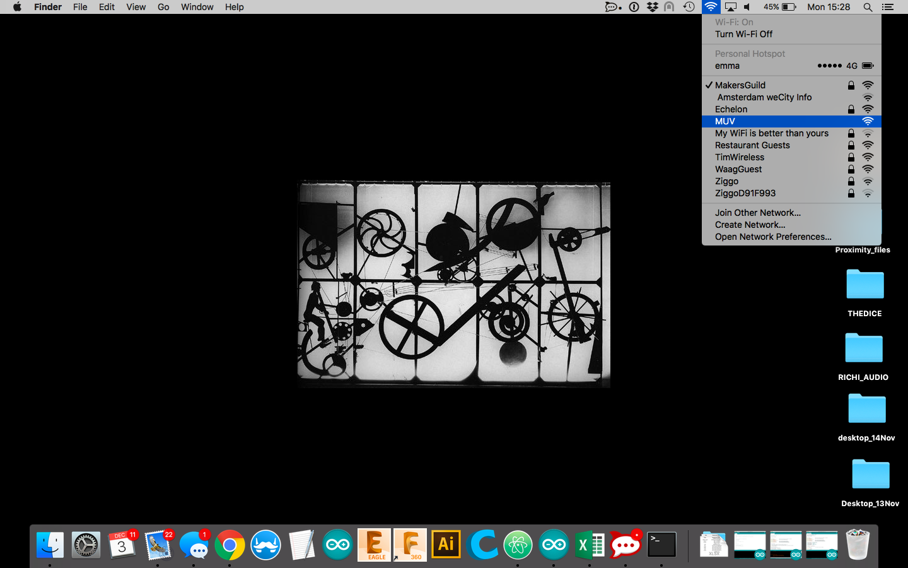| 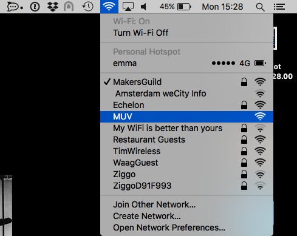|
| ------------- | ------------- |

Automatically on the device you are using (smartphone/tablet/computer) the configuration window will pop-up.

|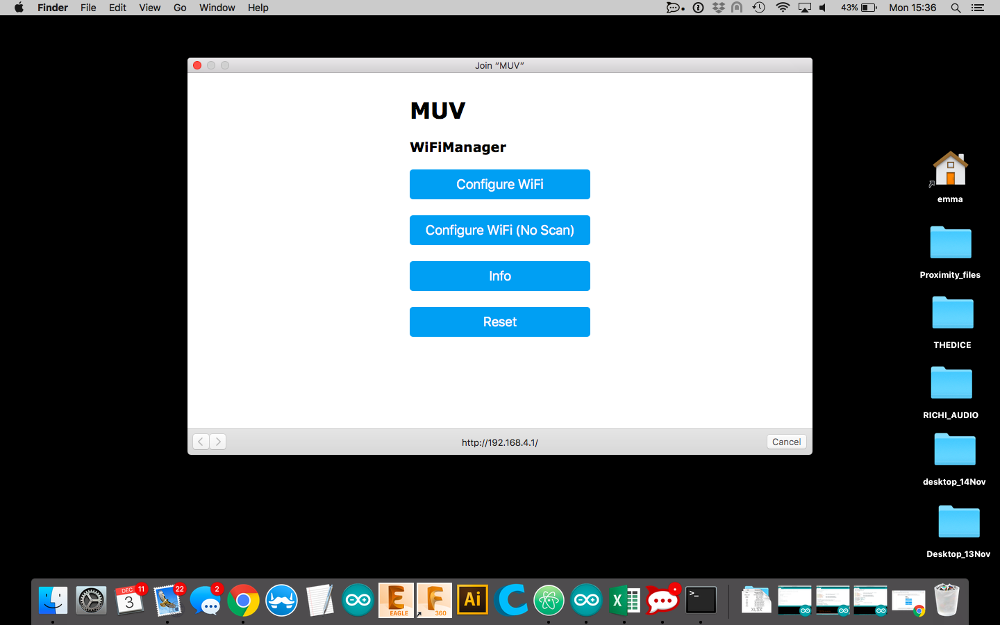| 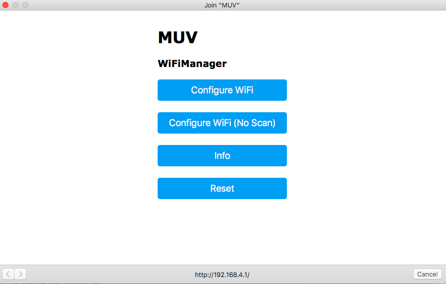|
| ------------- | ------------- |

If the window doesn't appear, open a browser and go to the address: http://192.168.4.1/.

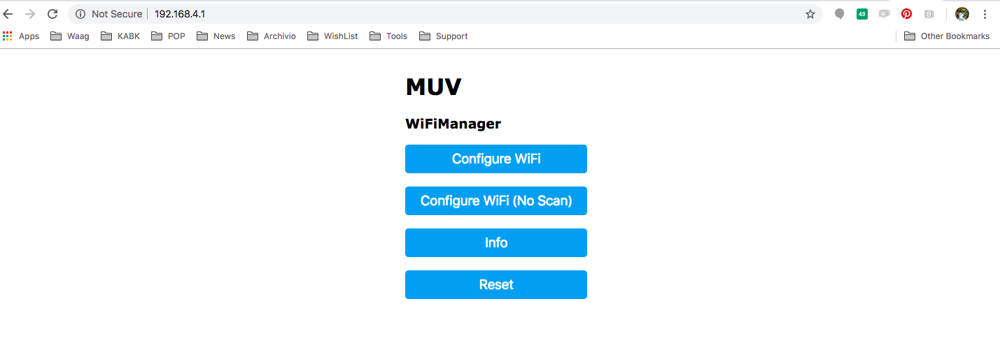

Clicking on Info, you can see the information related to the kit and find the PK_MUV kit ID that in the window is called Chip ID.

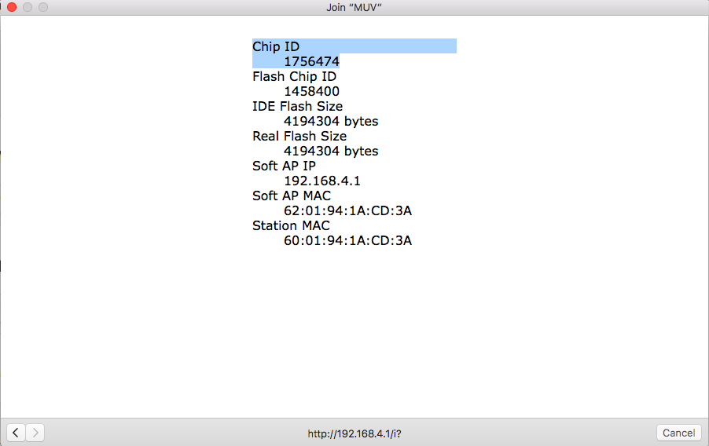

Clicking on Configure WiFi, you are in the right place to connect the kit to you local WiFi.

Select the WiFi and type the password.
In the tag "Insert address", write the location of the kit.

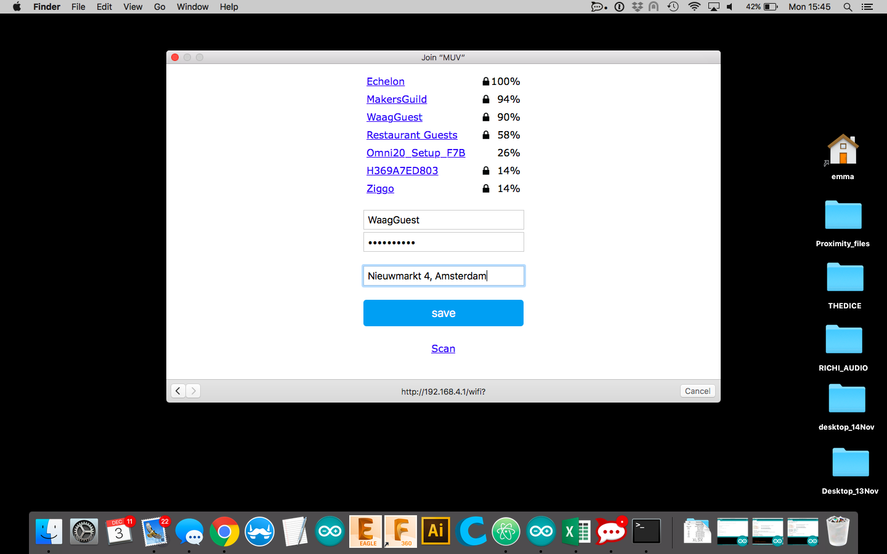

Click save and the kit will be now connected, the Config Led blinks green and you are ready to use the kit.
It is also possible to enter in configuration mode manually, see the below section [configuration mode](Configuration-Mode).

### Modes and Routines/Messages
The operation of the PK_MUV can be described by modes and routine.
The modes are conditions in which the kit is waiting for some actions from the users:
* **configuration mode**: the kit is waiting to be connected to the local WiFi
* **operation mode**: the kit is operating and waiting to detect a Tag_MUV

The routines are a set of actions that the kit executes when it is triggered:
* **start-up routine**: it happens when the kit is powered-on or reset
* **tag routine**: it happens when the kit detect a tag
* **check routine**: it happens when the user need to check the functionality of the kit
The
 

#### Configuration Mode
Config Led :  
The kit is in configuration mode when it is not connected to the Local WiFi. In configuration mode the Config Led is steady blue.
You can manually enter in configuration mode with the following steps: keep pushed the Config switch and reset the kit. Hold the Config switch until the Config Led turns blue, the PK_MUV can to connected to the local Wifi, see previous [section](Connect-the-PK-MUV-to-the-local-WiFi).

**note**: you can also use configuration mode to change the WiFi Network at which the PK_MUV is connected.

#### Operation Mode
Config Led: 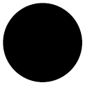 
If the kit has been successfully configured, it enters in operation mode.
The Tag Led and the Config Led are off, the NFC reader is ready to accept tags and the WiFi module is off to optimise the power consumption.
When the kit is operating and it has not been triggered by any tag, it will stay in operation mode.

#### Start-up routine
Config Led:  
When the kit is powered-on or reseted, it runs a sequence of test to verify that the proper functionality.
It will connect to the local WiFi, it will verify the connection with the server MUV and it will send a start-up message. If the execution of the start-up routine is successful the Config Led blinks green light and the start-up message is sent to the MUV server:

{"message":"startup","id":1756474,"location":"Nieuwmarkt 4, Amsterdam","rssi":-52, "batt":50}

for details about the payload content, see [Uplinks](Uplinks).

#### Tag Routine
Tag Led :  
When the reader get a Tag_MUV, the Tag Led blinks three times, meaning:
* the kit received a tag and the tag is recognised as Tag_MUV
* the kit connected to the local WiFi
* the kit sent the MUV message to the MUV server

and the kit will send to the MUV the following payload:

{"id":1756474,"uid":"04:23:AB:32:EC:4C:81”}

for details about the payload content, see [Uplinks](Uplinks).

The color code of the Tag Led is: 
 : the tag doesn't have the credential of the MUV project. 
 : the tag was recognised as MUV, but the the kit couldn't connect to the WiFi. 
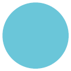 : the tag was recognised as MUV, it could connect to the WiFi but it couldn't reach the MUV server.

#### Check Routine
To execute the check routine, press once the Config Switch and you can verify the following features:
* battery level
* WiFi connection
* MUV server connectivity

The Batt Led will be steady for few seconds and the colour represents the battery level. 
The feedback of the routine is visualised on the Config Led: 
: the kit is operating properly and it will send the "check message". 
: the kit can't connect to the WiFi. 
: the kit can't reach the MUV server and the "check message" is not sent.

The message sent to the server is: 
{"message":"check","id":1756474,"location":"Funen","rssi":-59,"batt”:50} 
for details about the payload content, see below.

#### Uplinks
Depending by the triggered routines, the PK_MUV send three different messages to the MUV server (MQTT protocol). The topic is prox and the payloads, Jason format, are the following:

{"message":"startup","id":1756474,"location":"Nieuwmarkt 4, Amsterdam","rssi":-52, "batt":50} 
{"id":1756474,"uid":"04:23:AB:32:EC:4C:81”} 
{"message":"check","id":1756474,"location":"Nieuwmarkt 4, Amsterdam","rssi":-59,"batt”:50} 

messagge: triggered routine , start-up or check  
id: chipID or PK_MUV ID  
uid: Tag UID  
location: location of the kit, to be inserted during configuration mode  
rssi: rssi  
batt: battery level in %  

## Power supply and Battery Led
The PK_MUV kit runs on a rechargeable battery, a 2000mAh Lithium Ion Polymer cell last about 4 days when the PK_MUV kit works in operational mode. The status of the battery is visualised by the Batt Led:

* battery level >= 96%: Batt Led is steady on, green
* 20% > battery level >= 10%: Batt Led blinks, colour red.
* battery level < 10%: Batt Led is steady on, colour red.

When the Batt Led is red, the battery is almost empty. To recharge the internal battery you can use a micro USB cable and a +5V USB charger (the ones you use with phones are good), plug the cable to the USB port on the side of the kit. When the Batt Led is steady green, the battery is charged. While the kit is under charge, it still operates normally.

**Note**: when you charge the battery, be sure the power switch is ON otherwise the battery will not get charged.

You can run the PK_MUV kit without battery and use the USB cable to supply it. In this case it is recommended to disconnect the battery or leave the power switch in position OFF. In this setting, the Batt Led is steady off. 
**Note**: when the USB cable is plugged, the kit operated continuously.

Colour scale used during Check routine:
* 100% > battery level >= 80%: Batt Led colour green
* 80% > battery level >= 60%: Batt Led green/yellow
* 60% > battery level >= 40%: Batt Led yellow.
* 40% > battery level >= 20%: Batt Led orange.
* 20% > battery level >= 0: Batt Led colour red.

## MUV Tags
The Tags that have been successfully tested are NTAG2013 and NTAG203, they are manufactured in different shapes: key-chain, sticker, business card and bracelet.
To be able to use a Tag with the PK_MUV kit, you have to write in the Tag the MUV password and transform it in a Tag_MUV. On [this page](https://www.wakdev.com/en/apps.html) you find a list of apps to write NFC Tags but you also need a device to actually write the tag; in some cases the phone can do the job but in some other cases, for example if you have an iPhone6, you have to adopt an external device. During the testing phase of the PK_MUV, the ACR122 writer has been used with the desktop version of the software NFC tools.

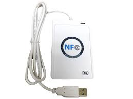

How to use the ACR122 with NFC tools: [link](https://www.wakdev.com/en/apps/nfc-tools-pc-mac.html) To have access to the key, see section [Contacts](Contacts).

## Troubleshooting
| Problem | Solution |
|---------| -------- |
| Config Led is on: purple   
  
| The FS are formatted and The WiFi settings reseted.   The Feather esp8266 must be reprogrammed.   See [Code](code) page. |
| Config Led is on: aqua   
  
| The MUV server can't be reached.   Reset the Kit.   Check the MUV credentials saved in the code |
| Config Led is on: blue   
  
 | The kit is in Configuration mode.  Ready to be connected to the Local WiFi: [how](#Connect-the-PK-MUV-to-the-local-WiFi)  |

## Contacts
To have access to the MUV password, please contact: XXX
